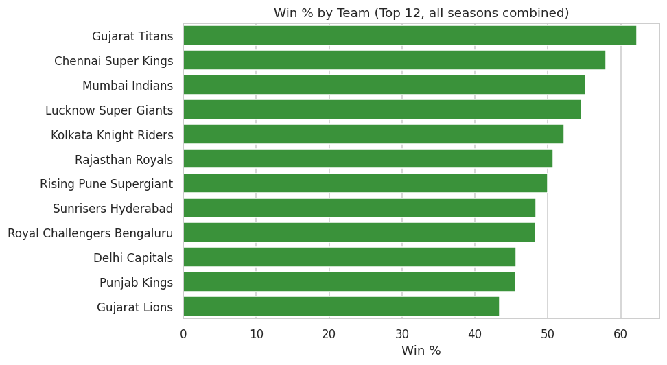
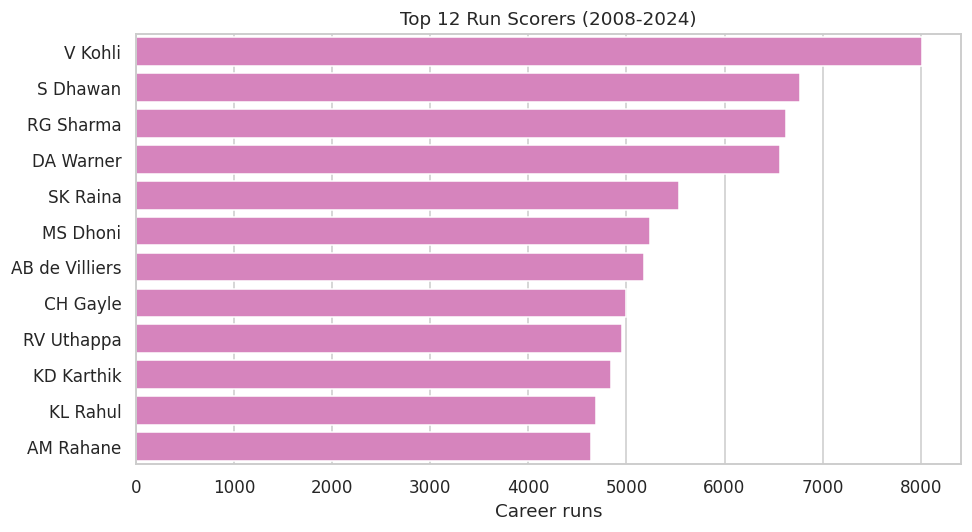
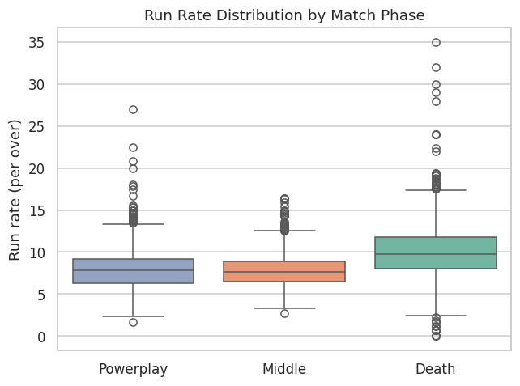

# IPL Cricket Performance & Strategy Analytics

End-to-end data analytics project on 17 seasons of IPL cricket (2008–2024):
Python for cleaning and EDA, SQL for structured analysis, and a Power BI
dashboard on top — built to answer one question.

> **Central question:** what performance patterns and match conditions are
> associated with winning in the IPL?

This is association analysis, not causal inference — the toss winner also
went on to win the match in barely half of games (see
[Key insights](#key-insights)), which is itself a finding worth taking at
face value rather than over-interpreting either way. That distinction
between correlation and causation is called out throughout, not just here.

---

## Table of contents
- [Overview](#overview)
- [Objectives](#objectives)
- [Dataset](#dataset)
- [Tools](#tools)
- [Data pipeline](#data-pipeline)
- [Data cleaning](#data-cleaning)
- [Feature engineering](#feature-engineering)
- [Exploratory data analysis](#exploratory-data-analysis)
- [SQL analysis](#sql-analysis)
- [Power BI dashboard](#power-bi-dashboard)
- [Key insights](#key-insights)
- [Limitations](#limitations)
- [Future improvements](#future-improvements)
- [How to run](#how-to-run)
- [Repo structure](#repo-structure)

---

## Overview

The IPL is 17 seasons and 250,000+ deliveries of ball-by-ball data — enough
to move past "who's the best team" trivia and into actual pattern-finding:
does winning the toss matter, is chasing better than defending, which teams
convert the powerplay into a platform and which fall away in the death
overs, and which venues reward a specific strategy. This project takes that
raw ball-by-ball data all the way from a CSV to a filterable dashboard.

## Objectives

1. Clean and structure raw IPL match + ball-by-ball data.
2. Engineer batting, bowling, and team-strategy metrics that don't exist in
   the raw columns (strike rate, economy, phase-wise scoring, chase success).
3. Answer a fixed set of strategy questions — toss impact, batting order,
   venue effects, phase performance — with both Python and SQL, so the same
   answer is checked two ways.
4. Package the results as an interactive Power BI dashboard a non-technical
   stakeholder (a team analyst, a fan) could actually use.
5. Do all of it inside a one-day build window, without pretending the result
   is more rigorous than a one-day analytics project actually is (see
   [Limitations](#limitations)).

## Dataset

**IPL Complete Dataset (2008–2024)** — `matches.csv` (1,095 matches) +
`deliveries.csv` (~260,000 deliveries), originally from
[Cricsheet](https://cricsheet.org), packaged on Kaggle by patrickb1912.

- Download: https://www.kaggle.com/datasets/patrickb1912/ipl-complete-dataset-20082020
- Full column dictionary and licensing note: [`data/README.md`](data/README.md)

## Tools

| Layer | Tools |
|---|---|
| Cleaning & EDA | Python — pandas, NumPy, Matplotlib, Seaborn |
| Structured analysis | SQL — MySQL 8+ / PostgreSQL 13+ |
| Dashboard | Power BI (Power Query + DAX) |
| Validation | Excel, for spot-checking a handful of aggregates by hand |
| Version control | Git / GitHub |

## Data pipeline

```
Raw CSVs (matches.csv, deliveries.csv)
        │
        ▼
Python: load → inspect → clean → feature engineer   (python/ipl_analysis.py)
        │
        ├──► EDA charts (images/*.png)
        ├──► Tidy tables (outputs/tables/*.csv)
        └──► Insight summary (outputs/insights.txt)
        │
        ▼
SQL: schema + 20 analytical queries                  (sql/)
        │
        ▼
Power BI: data model + DAX + 4-page dashboard         (powerbi/)
        │
        ▼
Key insights → README → resume → interview prep
```

## Data cleaning

Handled in `clean_matches()` / `clean_deliveries()` in
`python/ipl_analysis.py`:

- **Franchise renames** — `Delhi Daredevils` → `Delhi Capitals`,
  `Kings XI Punjab` → `Punjab Kings`,
  `Royal Challengers Bangalore` → `Royal Challengers Bengaluru`,
  `Rising Pune Supergiants` (typo variant) → `Rising Pune Supergiant`.
  Defunct franchises (Deccan Chargers, Pune Warriors, Gujarat Lions, Kochi
  Tuskers Kerala) are **left alone** on purpose — they're not the same legal
  entity as any later team, so merging them would misattribute history.
- **Missing `city`** on a handful of neutral-venue (UAE) matches — recovered
  by mapping `venue → city` from every other row that shares that venue,
  rather than dropping the matches.
- **`season` formatting** — some seasons are stored as `"2020/21"`; sliced
  to the starting year and cast to `int` for consistent grouping.
- **Dates** parsed to proper `datetime`.
- **`result_margin` nulls** left as `NaN` on purpose — they're null exactly
  for ties/no-results, which is real information, not missing data.
- **Duplicates** dropped on `matches.id` and on full-row duplicates in
  `deliveries`.
- Nothing is dropped blindly — every null/duplicate is inspected first
  (`inspect()`), then handled with a rule, not silently deleted.

## Feature engineering

All computed in `python/ipl_analysis.py`, exported to `outputs/tables/`, and
mirrored in SQL (`sql/analysis_queries.sql`):

- **Batting:** runs, balls faced (wides excluded), strike rate, average,
  fours, sixes, boundary % of total runs.
- **Bowling:** runs conceded, legal balls bowled (wides + no-balls
  excluded), economy rate, wickets (run-outs excluded — not the bowler's
  dismissal), bowling strike rate.
- **Phase-wise:** every delivery tagged Powerplay (overs 1–6) / Middle
  (overs 7–15) / Death (overs 16–20); run rate and wickets aggregated per
  phase, per innings.
- **Team strategy:** who actually batted first (read from ball-by-ball
  inning-1 data, not inferred from the toss decision — safer than reasoning
  through toss logic by hand), win %, toss-win %, toss-win→match-win %,
  batting-first win %, chasing win %.
- **Venue:** matches hosted, average first-innings target, batting-first
  win % per venue.

## Exploratory data analysis

`run_eda()` in `python/ipl_analysis.py` (and the equivalent cells in
`notebooks/IPL_Analysis.ipynb`) produce 10 charts in `images/`:

1. Matches per season
2. Win % by team (top 12)
3. Toss winner vs match winner
4. Batting first vs chasing — win %
5. Top 12 run scorers
6. Strike rate vs batting average (qualified batters)
7. Top 12 wicket takers
8. Best economy rate (qualified bowlers)
9. Run-rate distribution by match phase (Powerplay / Middle / Death)
10. Average 1st-innings score by season

These land in `outputs/images/` (gitignored — regenerated by re-running the
script). Copy 2-4 favorites into the repo's `images/` folder afterward so
they render inline on GitHub — see `images/README.md` for the exact syntax.

## SQL analysis

`sql/schema.sql` — two tables (`matches`, `deliveries`), indexed on the
columns actually used for joins/filters, with `LOAD DATA` / `\copy`
instructions for MySQL and PostgreSQL.

`sql/analysis_queries.sql` — 20 queries covering `SELECT`/`WHERE`/`GROUP
BY`/`ORDER BY`, `CASE`, aggregations, `JOIN`, CTEs, subqueries (including a
correlated subquery), and window functions (`RANK`, `ROW_NUMBER`, `LAG`).
Every query is commented with which SQL technique it demonstrates — built to
double as interview material, not just to produce output.

## Power BI dashboard

Full data model, every DAX measure, and an exact page-by-page layout are in
[`powerbi/dashboard_documentation.md`](powerbi/dashboard_documentation.md).
Four pages: **Overview**, **Batsman & Bowler Analytics**, **Match
Strategy**, **Player/Team Deep Dive** — with a `Team`/`Player`/`Season`/`Venue`
slicer set driving all four.

## Key insights

*(Auto-generated by the pipeline — computed live from the real 2008–2024
dataset. Every number below came straight out of `outputs/insights.txt` on
a real run, nothing here is estimated or rounded from memory.)*

1. **Toss impact:** the toss winner also won the match in **50.6%** of games (1,095 matches, 2008–2024) — essentially a coin flip. This is an association, not proof the toss caused the result, but it's also a direct data point against the "win the toss, win the match" narrative that gets repeated every broadcast.
2. **Batting order:** teams won **53.9%** of the time chasing vs **45.7%** batting first, across all venues and seasons — a real, if modest, chasing edge league-wide (the missing ~0.4% is ties/no-results).
3. **Most successful franchise:** **Gujarat Titans** lead on win % at **62.22%** (28 wins from 45 matches) — helped by a small sample as a newer franchise; **Chennai Super Kings** lead among the long-running teams at **57.98%** (138 wins from 238 matches).
4. **All-time leading run scorer:** **V Kohli** with **8,014** runs, ahead of S Dhawan (6,769), RG Sharma (6,630), and DA Warner (6,565).
5. **All-time leading wicket taker:** **YS Chahal** with **205** wickets.
6. **Most-used venue:** **Eden Gardens** (77 matches), where teams batting first won only **38.96%** of the time — a real venue-specific chase-favoring signal, well below the league-wide batting-first rate.

A few more pulled straight from `outputs/tables/`:
- **Highest strike rate (qualified, 200+ balls faced):** AD Russell at **174.84**, with PD Salt just ahead of him unqualified-adjacent at 175.54 on a smaller sample.
- **Best economy rate (qualified, 300+ balls bowled):** A Chandila at **6.28**, followed closely by SMSM Senanayake (6.59) and the long-retired SM Pollock (6.67) — a reminder that the "best economy ever" leaderboard is dominated by bowlers from the tournament's lower-scoring early seasons, not current stars.

Finding → supporting metric → interpretation → implication, for each: see
`outputs/insights.txt`, and the phase/venue/season breakdowns in
`outputs/tables/*.csv` for anything more granular than these headline numbers.

A few of the resulting charts, for a quick look without running anything:





## Limitations

- **Association, not causation.** Every "X is linked to winning" finding in
  this project is a correlation in historical data, not a controlled
  experiment — toss decisions, batting orders, and venue choices are not
  randomly assigned, so confounders (ground conditions, dew, team strength
  itself) are mixed in with whatever effect the variable of interest has.
- **Survivorship in "qualified" leaderboards.** Strike-rate and economy
  leaderboards use a minimum-balls cutoff specifically to avoid one-innings
  fluke; that cutoff is itself a judgment call and changes who appears.
- **Franchise continuity is a modeling choice.** Treating `Delhi Daredevils`
  and `Delhi Capitals` as one team (but *not* merging Deccan Chargers into
  anything) reflects real ownership/branding history as best available
  public knowledge — a different analyst could reasonably draw that line
  differently.
- **No player-price/auction, weather, or pitch-report data** — venue effects
  in this project are behavioral (what teams *did* at that venue), not
  explained by *why* (pitch type, dew factor, boundary size), because that
  data isn't in Cricsheet.
- **One-day build.** This is a portfolio-scale project, not a
  publication-grade study — sample sizes for some season/venue/player cuts
  are small enough that a single unusual match can move a percentage a few
  points.

## Future improvements

- Add a simple win-probability model (logistic regression on toss, venue,
  bat/chase, and team strength) as a natural next step past pure EDA.
- Bring in ball tracking / pitch data if a licensed source becomes available,
  to move the venue analysis from "what happened" to "why."
- Extend the Power BI model with a player-market-value dimension (auction
  price data is public separately) to look at value-for-performance, not
  just performance.
- Automate the Kaggle → pipeline → dashboard refresh with a scheduled script
  each time a new season's data is released, instead of a one-time run.

## How to run

1. **Download the dataset.** The raw `matches.csv` and        `deliveries.csv` files are intentionally excluded from GitHub because they are large source files. See [`data/README.md`]  (data/README.md) for the dataset download instructions.
2. **Python environment:**
   ```powershell
   python -m venv venv
   venv\Scripts\Activate.ps1
   pip install -r requirements.txt 
   ```
3.**Run the analysis:**
   ```powershell
   cd python
   python ipl_analysis.py --data-dir ..\data --out-dir ..\outputs
   ```
4. **Notebook version (optional, for the narrative walkthrough):**
   ```bash
   jupyter notebook notebooks/IPL_Analysis.ipynb
   ```
5. **SQL:** create the database from `sql/schema.sql`, load the two CSVs
   (instructions are in that file, or load `outputs/tables/match_level.csv`
   instead if you want the already-cleaned version), then run
   `sql/analysis_queries.sql`.
6. **Power BI:** open Power BI Desktop → Get Data → point at `data/` (or
   `outputs/tables/`) → follow `powerbi/dashboard_documentation.md` to build
   the model, measures, and four pages.

## Repo structure

```
IPL-Cricket-Analytics/
├── data/
│   └── README.md                  # dataset source, license, column dictionary
├── python/
│   └── ipl_analysis.py            # full pipeline: clean → feature engineer → EDA → export
├── notebooks/
│   └── IPL_Analysis.ipynb         # narrative walkthrough of the same pipeline
├── sql/
│   ├── schema.sql                 # CREATE TABLE + load instructions
│   └── analysis_queries.sql       # 20 interview-ready analytical queries
├── powerbi/
│   └── dashboard_documentation.md # data model, DAX, 4-page layout spec
├── images/                        # EDA chart output lands here after running the script
├── requirements.txt
├── .gitignore
└── README.md
```

---

*Data: [Cricsheet](https://cricsheet.org) (cricsheet.org), packaged as the
IPL Complete Dataset (2008–2024) on Kaggle by patrickb1912.*
